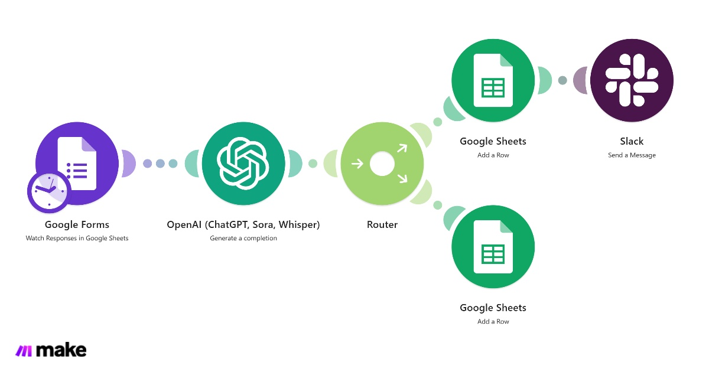
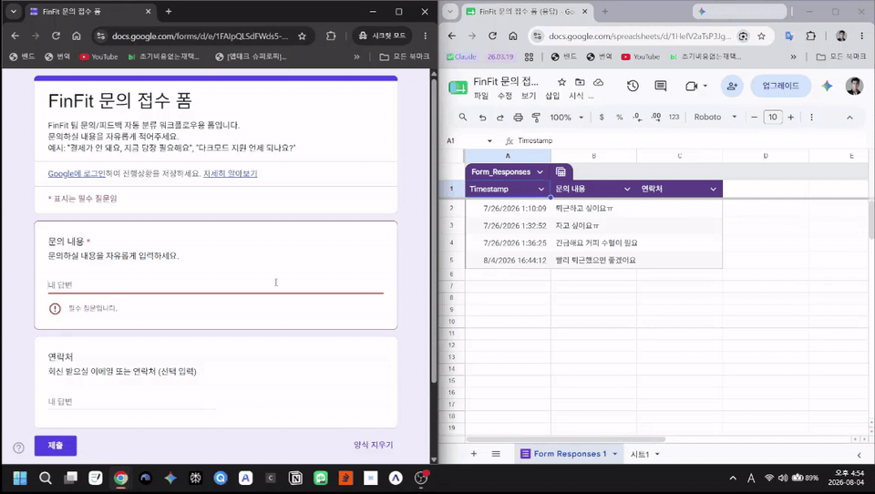
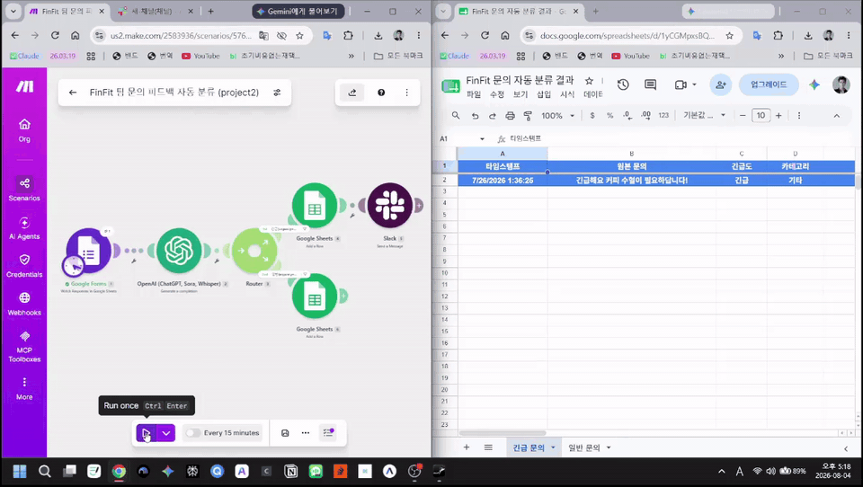
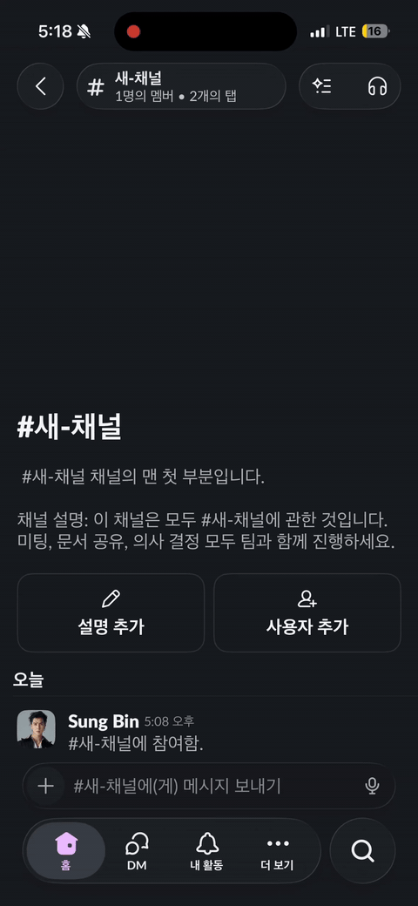
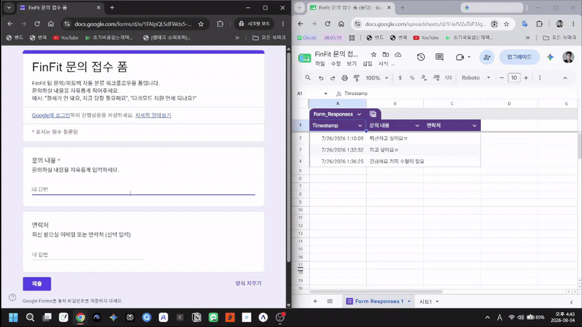
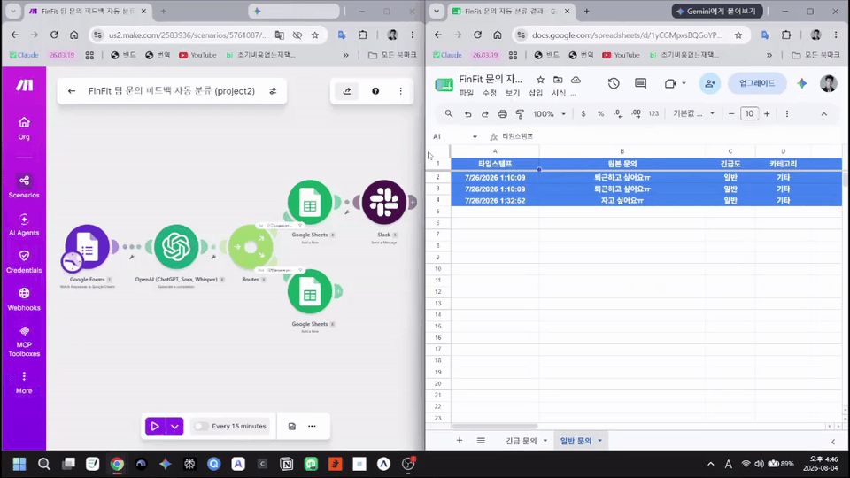

# project2/report/design.md — 팀 문의/피드백 자동 분류 파이프라인

GitHub에서 이 문서를 열면 **구현 화면(§3.1)** 과 **실행 GIF(§7)** 를 바로 볼 수 있다.

## 1. 반복 업무 정의

FinFit 팀/제품에 들어오는 문의·피드백을 사람이 매번 읽고 "이거 긴급한가?"를 판단해서
담당자에게 전달하는 작업. 문의량이 늘면 판단·전달에 드는 시간이 누적된다.
이 워크플로우는 문의가 들어오는 즉시 AI가 긴급도·카테고리를 판단하고,
긴급 건만 담당자에게 즉시 알리고 나머지는 로그로만 남긴다.

## 2. 도구 선정

**Make.com** (도구 A 재사용, 프로젝트1과 계정 동일)

| 후보 | 판단 |
|---|---|
| Make (채택) | 클라우드 상시 구동 — 팀 문의를 "실제로" 상시 수신하는 시나리오에 적합. 프로젝트1에서 계정·연동 경험 있어 셋업 빠름 |
| n8n | 완전 무료지만 로컬/서버 상시 기동 필요 — 개인 PC 기반 데모에는 적합해도 "팀이 상시 쓰는 도구"로는 부적합 |

## 3. 워크플로우 구조

```
[Trigger] 문의 접수 폼 응답 감지 (Google Forms → 응답 시트 폴링)
      │
      ▼
[Action 1] OpenAI (Chat Completion, JSON 모드)
      │  문의 내용 → { urgency: "긴급"/"일반", category: "버그/기능요청/결제/기타", summary }
      ▼
[Filter/Router] 2-Way 조건 분기
      ├─ 긴급 (urgency = "긴급")  → [Action 2] Sheets 기록 + [Action 3] Slack `#새-채널`(Public) 알림
      └─ 일반 (urgency = "일반")  → [Action 2] Sheets 기록만
```

- Trigger 1개 (폼 응답 감지) ✅
- Action 2개 이상 (AI 분류 + Sheets 기록, 긴급 시 알림까지 3개) ✅
- 조건 분기 1개 이상 (긴급/일반 2-way) ✅ — 프로젝트1의 3-way와 구조를 다르게 가져가 구분
- 보너스1 (AI 연동 Action) — OpenAI 분류로 자연 충족 ✅

### 3.1 구현 화면 (Make 캔버스)

시나리오 전체 구성 화면. (파일: `../make/Make_workflow_view.jpeg`)



## 4. 필드 스키마 (OpenAI 응답)

```json
{
  "urgency": "긴급 또는 일반",
  "category": "버그, 기능요청, 결제, 기타 중 택1",
  "summary": "문의 내용을 15자 이내로 요약"
}
```

## 5. 알림 채널

**최종 채택·검증 (제출 기준):** Slack **공개(Public) 채널 `#새-채널`**.

| 항목 | 값 | 근거 |
|------|-----|------|
| 채널 유형 | **Public** (`channelType = public`) | Make Blueprint · Slack UI 채널명 앞 **`#`** |
| 채널 이름 | **`#새-채널`** | 실행 GIF 상단 헤더·본문 제목 |
| 메시지 | Make 앱 → `[FinFit 긴급 문의]…` | 동일 GIF 타임라인 |
| 증거 파일 | [`../gif/make_urgent_3_slack.gif`](../gif/make_urgent_3_slack.gif) | §7.1 ③ 임베드 |

설계 단계에서는 “공개 **또는** 비공개 팀 채널”을 후보로 적었으나, **비공개(`private`)·DM(`im`)은 최종 미사용**.  
공개 Blueprint의 채널 ID는 `***SLACK_TEAM_CHANNEL_ID***` 마스킹 → Import 후 Make에서 **Public · `새-채널`** 재선택. (상세: [`../README.md`](../README.md) §7)

**대체안 (리스크 완화, 미사용)**  
Slack 권한이 없을 경우 → Gmail 알림, 또는 결과 시트「긴급 문의」탭만.

## 6. 테스트 케이스

### 6.1 설계용 예시 입력 (의도·프롬프트 검증용)

폼 설명·Apps Script 예시와 동일한 **권장 입력**이다. 구조 검증용 시나리오이며,  
§6.2의 **제출 GIF에 찍힌 실제 문구와는 다를 수 있다.**

| # | 문의 내용 예시 | 기대 결과 |
|---|---|---|
| A | "결제가 안 돼요, 지금 당장 필요해요" | urgency=긴급 → Sheets「긴급 문의」+ Slack `#새-채널` |
| B | "다크모드 지원 언제 되나요?" | urgency=일반 → Sheets「일반 문의」만 |

### 6.2 제출 GIF에 실제 기록된 케이스 (교차검증 기준)

| 분기 | 결과 시트에 보이는 원본 문의 (요지) | urgency / category | 증거 GIF |
|------|--------------------------------------|--------------------|----------|
| 긴급 | 커피 수혈 요청 · **탕비실 응급(쓰러짐)** 등 | 긴급 / 기타 | §7.1 `make_urgent_*` |
| 일반 | 피곤·수면·퇴근 등 **비즉시성** 문장 | 일반 / 기타 | §7.2 `make_normal_*` |

- 긴급 Slack 본문(GIF): 탕비실 관련 긴급 문의 + Make 앱 → **`#새-채널`**  
- 분기 동작(긴급=시트+Slack, 일반=시트만)은 설계 §3과 **일치**.  
- 문서에 “결제/다크모드”만 적고 GIF 문구를 안 적으면 **구현 증거와 불일치**로 보이므로, 제출 기준은 **§6.2 + §7** 이다.

파일 목록·명명: [`../gif/README.md`](../gif/README.md)

### 6.3 구현 디테일 (Blueprint·실행 UI와 문서 정합)

| 항목 | 실제 구현 | 비고 |
|------|-----------|------|
| Trigger | `google-forms:watchRows` · 탭 `Form Responses 1` | 한국어 UI면 `양식 응답 1` 가능 → 드롭다운 실명 선택 |
| AI | OpenAI **`gpt-4.1`** · JSON `urgency/category/summary` | Make UI 모듈명에 Sora/Whisper 표기가 보여도 **Completion만 사용** |
| Router | `urgency` 텍스트 equal `긴급` / `일반` | 2-way |
| Sheets 탭 | **`긴급 문의`** / **`일반 문의`** | 프로젝트1「고액…」탭 이름 **미사용** |
| Slack | **Public · `#새-채널`** | `make_urgent_3_slack.gif` |
| 스케줄(데모) | Make 시나리오 **Every 15 minutes** (GIF 하단) | 폴링 주기 · ON 시 자동 실행 |
| 결과 시트 헤더 | 타임스탬프·원본 문의·긴급도·카테고리·요약·연락처 | Apps Script와 동일 |

---

## 7. 실행 결과 화면 (GIF — 설계 문서에서 바로 보기)

GitHub·VS Code 등 Markdown 미리보기에서 아래 이미지를 클릭·재생할 수 있다.  
원본 경로: `../gif/make_*.gif` (프로젝트1 보고서와 동일한 **문서 임베드** 방식).

### 7.1 긴급 분기

**① 폼 제출** — `../gif/make_urgent_1_form.gif`



**② Make 액션** — 시나리오 실행 → 「긴급 문의」탭 — `../gif/make_urgent_2_action.gif`



**③ Slack 알림 (최종 검증)** — **`#새-채널` · Public** · Make 앱 메시지 — `../gif/make_urgent_3_slack.gif`

> GIF에서 확인할 것: 상단 **`# 새-채널`**, 본문 제목 **`#새-채널`**, 발신 **Make 앱**, 본문 `[FinFit 긴급 문의]…`  
> → 문서의 “공개 채널 `새-채널`” 표기와 **일치**. DM/비공개 화면 아님.



### 7.2 일반 분기

**① 폼 제출** — `../gif/make_normal_1_form.gif`



**② Make 액션** — 「일반 문의」탭만 (Slack 없음) — `../gif/make_normal_2_action.gif`



### 7.3 증거 한눈에

| 분기 | form | action | 추가 |
|------|------|--------|------|
| 긴급 | [make_urgent_1_form.gif](../gif/make_urgent_1_form.gif) | [make_urgent_2_action.gif](../gif/make_urgent_2_action.gif) | [make_urgent_3_slack.gif](../gif/make_urgent_3_slack.gif) |
| 일반 | [make_normal_1_form.gif](../gif/make_normal_1_form.gif) | [make_normal_2_action.gif](../gif/make_normal_2_action.gif) | — |

구현 화면: [Make_workflow_view.jpeg](../make/Make_workflow_view.jpeg) · 재현·Slack 설정: [`../README.md`](../README.md)

---

## 8. 구현 ↔ 문서 교차검증 요약 (깊은 점검)

| 영역 | 일치? | 설명 |
|------|:-----:|------|
| 모듈 구성 (Forms→OpenAI→Router→Sheets×2+Slack) | ✅ | Blueprint · `Make_workflow_view.jpeg` · action GIF 캔버스 |
| 2-way 분기 urgency 긴급/일반 | ✅ | filter + 결과 탭 분리 GIF |
| Slack `#새-채널` Public | ✅ | `make_urgent_3_slack.gif` · Blueprint `channelType=public` |
| 일반 경로 Slack 없음 | ✅ | normal action GIF는 시트「일반 문의」만 |
| 폼 제목·필드 (문의 내용/연락처) | ✅ | form GIF · Apps Script |
| 설계 예시 문구(결제/다크모드) vs GIF 실입력 | ⚠️→문서분리 | **§6.1 의도 / §6.2 실증거** 로 분리해 해소 |
| Blueprint restore 라벨「고액 지출…」 | ⚠️→수정 | 프로젝트1 잔여 → **`긴급 문의`/`일반 문의`** 로 정리 |
| make README「긴급+이메일」 | ⚠️→수정 | 실구현은 **Slack** (이메일 모듈 없음) |
| 스케줄 15분 / 모델 gpt-4.1 | ⚠️→문서화 | GIF·Blueprint에 있음, 설계에 §6.3으로 명시 |
