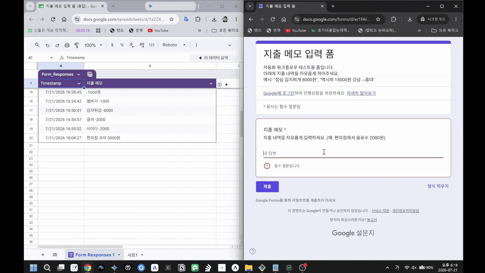
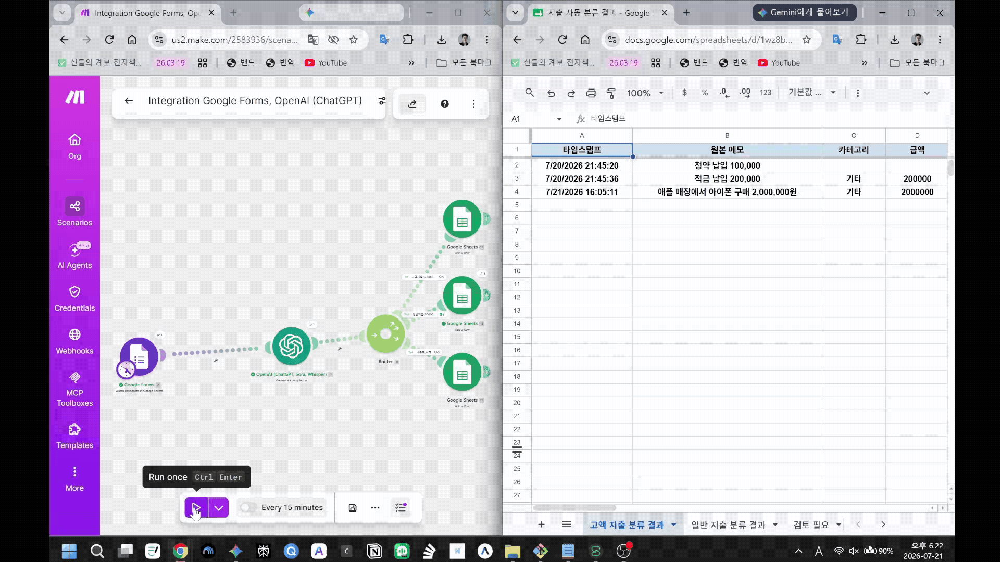
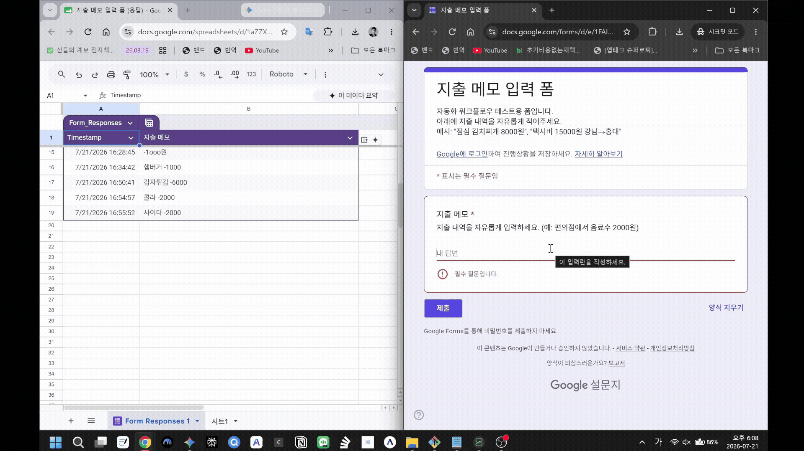
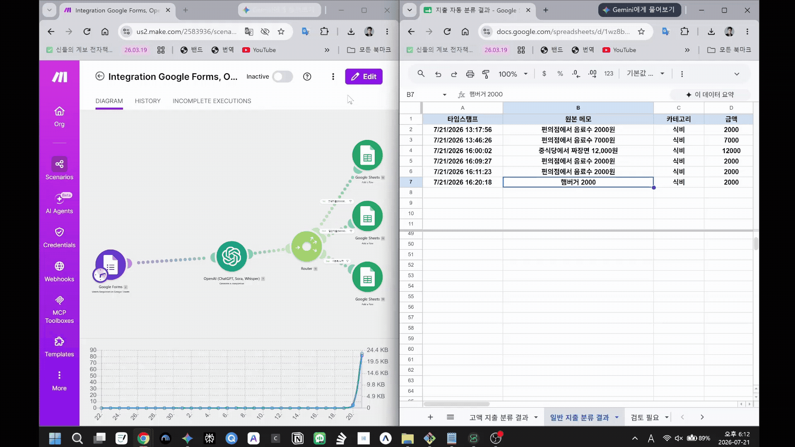
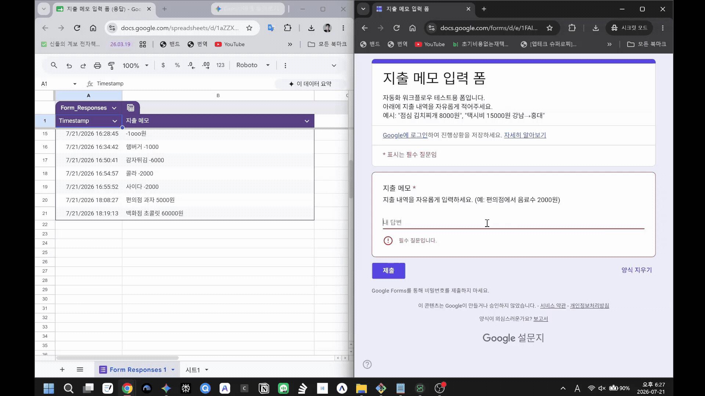
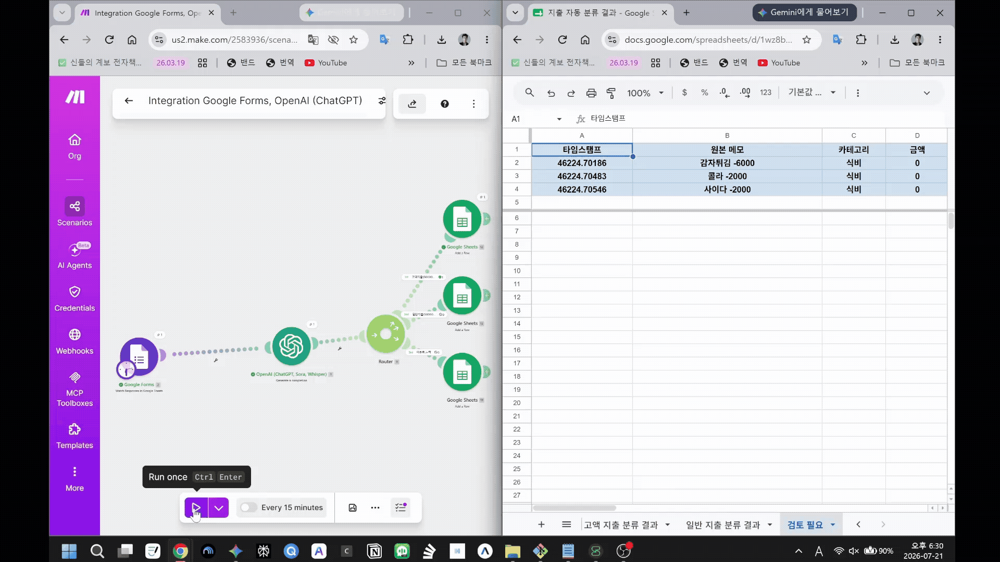
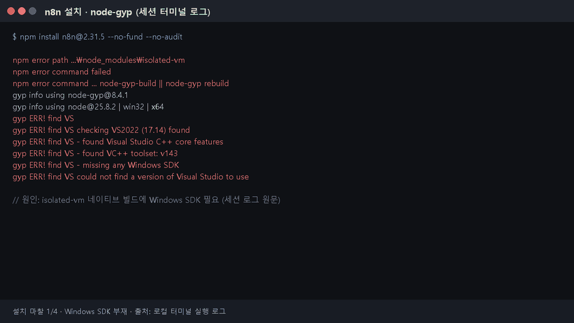
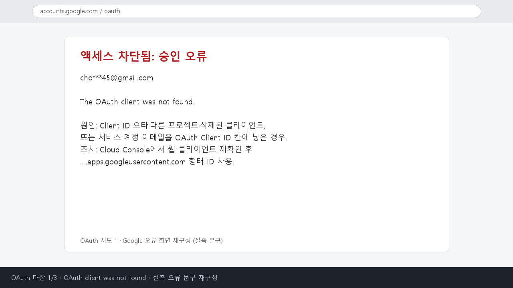
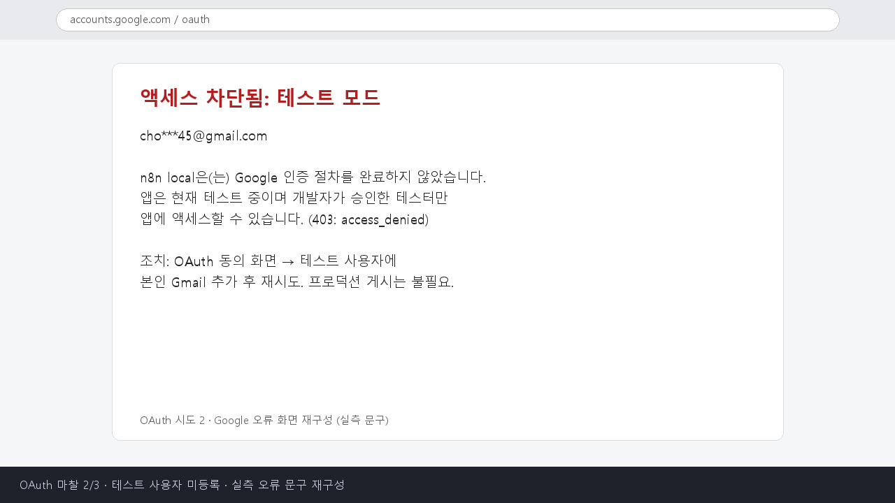

# 프로젝트 1 — 자동화 도구 비교 분석 보고서

**주제:** 지출 메모 자동 분류 파이프라인  
**커리큘럼:** Codyssey · AI 도구 학습 · 노코드 자동화 기초  
**작성 상태:** 초안 — **Make GIF 확보 완료** / **n8n GIF만 추가 촬영 예정**  
**보안:** 제출 전 계정 이메일·시트 URL·API Key 마스킹 필수

---

## 0. 문서·미디어 사용 안내

### 0.1 GIF 위치

| 구분 | 경로 | 상태 |
|------|------|------|
| Make 원본 | 프로젝트 루트 `gifs/` | ✅ 6개 확보 |
| Make 보고서용 GIF | `gifs/` (`make_*.gif`) | ✅ 영문 별칭 |
| n8n 설치·OAuth 마찰 | `png/` (PNG·GIF·README·렌더 스크립트) | ✅ 로그 기반 생성 |
| n8n 실행 촬영 | `gifs/n8n_*.gif` | ⬜ **앞으로 촬영** |

### 0.2 Make GIF 매핑 (이미 있음)

| 분기 | 폼 응답 | 에이전트(시나리오) 액션 |
|------|---------|-------------------------|
| 고액 | `make_high_1_form.gif` ← `고액_지출_1_폼_양식_응답.gif` | `make_high_2_action.gif` |
| 일반 | `make_normal_1_form.gif` | `make_normal_2_action.gif` |
| 미분류(기타) | `make_review_1_form.gif` ← `기타_지출_*` | `make_review_2_action.gif` |

### 0.3 n8n만 남음 — 촬영 체크리스트

| 파일 (저장 위치 `gifs/`) | 촬영 내용 | 우선 |
|----------------------------------|-----------|------|
| `n8n_workflow_overview.gif` | 캔버스 전체 (Trigger1→OpenAI→정규화→Switch→Sheets×3) | 필수 |
| `n8n_run_high.gif` | 고액 1건: 폼 제출→Executions「고액 지출 기록」Success→결과 시트 행 | 필수 |
| `n8n_run_normal.gif` | 일반 1건 (동일 패턴) | 필수 |
| `n8n_run_review.gif` | 미분류 1건 (음수 등,「검토 필요 기록」) | 필수 |

설치·OAuth 마찰 미디어는 **`png/`** 에 분리 보관 (확장자·생성물 구분).

**촬영 팁:** n8n `http://localhost:5678` · Active ON · 이메일/URL 가림 · 10–25초.

---

## 1. 사용한 도구

| 구분 | 도구 | 배포 형태 | 역할 |
|------|------|-----------|------|
| **도구 A** | **Make.com** (구 Integromat) | 클라우드 SaaS | 동일 워크플로우 1차 구현·검증 |
| **도구 B** | **n8n** (Self-hosted) | 로컬 Node 실행 (`n8n-runtime`) | 동일 워크플로우 2차 재현·비교 |
| (검토 후 미채택) | Zapier Free | 클라우드 | Free 플랜 2단계 제한으로 **동일 구조 재현 불가** |

### 1.1 도구 B를 Zapier가 아닌 n8n으로 한 이유 (과금·제약 대응)

미션 제약: *무료 플랜으로 완수 가능한 조합 우선*, *유료가 불가피했다면 이유와 무료 대안을 보고서에 정리*.

| 후보 | 판단 |
|------|------|
| **Zapier Free** | Zap당 **트리거 1 + 액션 1 (2단계)**. Multi-step·Paths(조건 분기) 불가 → 본 시나리오(폼/시트 감지 → OpenAI → 3분기 → Sheets×3) **구조적으로 재현 불가** |
| **Zapier Professional 이상** | 멀티스텝·Paths 가능하나 **유료(또는 체험 의존)**. 학습 미션의 무료 우선 원칙과 충돌 |
| **n8n Self-hosted (채택)** | IF/Switch·멀티스텝·실행 횟수 제한 없이 **무료**. 미션 예시의 *「자가호스팅 가능한 도구 + 무료 연동 앱」* 과 정합 |

**유료가 불가피했던 경우(가상 채택 시):** Zapier로 동일 구조를 유지하려면 Professional 이상이 불가피.  
**무료 대안:** n8n 셀프호스트(본 프로젝트 채택) 또는 Make 무료 Ops 범위 내 구현(도구 A).

---

## 2. 공통 워크플로우 정의

### 2.1 자동화 대상 업무

사용자가 **Google Form**에 자유 형식 지출 메모를 제출하면,

1. 메모를 **생성형 AI(OpenAI)** 가 JSON으로 파싱하고  
2. 금액·유효성(`Classification`)에 따라 **3갈래로 분기**하며  
3. **Google Sheets** 결과 시트의 해당 탭에 한 행을 기록한다.

### 2.2 구조 (도구 A·B 동일)

```
[Trigger] 폼 응답 시트 새 행 감지 (폴링)
    → [Action] OpenAI JSON 파싱
         { category, amount, summary, Classification }
    → [Router / Switch] 3-Way
         ├─ A. amount ≥ 50000                    → 탭「고액 지출 분류 결과」
         ├─ B. amount < 50000 AND ≠ 분류불가     → 탭「일반 지출 분류 결과」
         └─ C. amount = 0 AND 분류불가           → 탭「검토 필요」
```

| 미션 공통 요구 | 충족 |
|----------------|------|
| Trigger 1+ | ✅ Sheets/Forms 폴링 |
| Action 2+ | ✅ OpenAI + Sheets Append |
| 조건 분기 1+ | ✅ 3-Way Router/Switch |
| 각 분기 1회 이상 실행 | ✅ (고액·일반·미분류 결과 시트 및 실행 로그로 확인) |
| 보너스1 AI 연동 | ✅ OpenAI 파싱 |

### 2.3 트리거 표기 vs 실체

| 도구 | UI 표기 | 실제 메커니즘 |
|------|---------|----------------|
| Make | Google Forms – Watch Rows 등으로 표기되는 경우 | **응답 스프레드시트 폴링** |
| n8n | **Google Sheets Trigger** (Forms 전용 노드 없음) | **동일: 응답 시트 Row Added 폴링** |

→ “동일 워크플로우 재현” 요건상 데이터 소스·흐름은 동일. 보고서·캡처에서는 노드명이 Sheets로 나오는 점을 명시.

### 2.4 공유 리소스 (민감정보는 마스킹)

| 리소스 | 용도 |
|--------|------|
| 지출 메모 입력 폼 | 사용자 입력 |
| 폼 응답 스프레드시트 | Trigger 감시 |
| 지출 자동 분류 결과 (탭 3) | 분기별 Append |
| OpenAI API | 파싱 Action |

---

## 3. 구현 과정 요약

### 3.1 도구 A — Make.com

1. 폼·응답 시트·결과 시트(탭 3·헤더 6열) 준비 (Apps Script `create_google_form.js` 등).  
2. 시나리오: Forms/Sheets Watch → OpenAI Chat (`gpt-4.1`, `json_object`, `parseJSONResponse`) → BasicRouter 3갈래 → Sheets Add a Row ×3.  
3. 시스템 프롬프트에 **음수·무료 0원·파싱 불가** 규칙을 분리 (`Classification`).  
4. 트러블슈팅:  
   - Sheets `values` 미매핑 → 빈 행 삽입 → 컬럼 매핑 수정.  
   - 필터가 응답 객체 전체를 비교 / OR 조건으로 오분류 → `amount`·`Classification` AND 조건으로 수정.  
5. Blueprint 내보내기: `Integration Google Forms, OpenAI (ChatGPT).blueprint.json`.

#### Make 동작 GIF (촬영 완료 · `gifs/` → `gifs/`)

**고액 분기 — 폼 응답**



**고액 분기 — 시나리오 액션**



**일반 분기 — 폼 응답**



**일반 분기 — 시나리오 액션**



**미분류(기타) 분기 — 폼 응답**



**미분류(기타) 분기 — 시나리오 액션**



> 원본: 루트 `.gif/` 또는 고액_지출_*`, `일반_지출_*`, `기타_지출_*` (프로젝트 루트).

---

### 3.2 도구 B — n8n (Self-hosted)

1. **설치 마찰 (무료의 대가)**  
   - Docker 없음 → Node 기반 로컬 설치.  
   - `isolated-vm` 네이티브 빌드에 **Windows SDK** 필요.  
   - 구형 node-gyp가 Windows11SDK 패키지명을 인식 못 함 → **node-gyp 11** + 수동 재빌드로 해소.  
   - 비교 항목「설정 난이도」의 핵심 근거.  
2. owner 계정 생성 → Google **Sheets Trigger OAuth2** + **Sheets OAuth2**(Append용, 타입 분리) + OpenAI credential.  
3. 워크플로우 최종안: `지출 메모 자동 분류 (n8n).json`  
   - `Google Sheets Trigger1` → `OpenAI 파싱` → `JSON 정규화` → `Router 3분기` → Append×3.  
4. **Append 미적재 대응 패치**  
   - `documentId` **id 모드**, `useAppend: true`, 6열 String 매핑.  
   - Code를 `runOnceForEachItem`으로 변경 (`first()` 1건만 처리하던 위험 제거).  
   - OpenAI `json_object` 포맷 복구.  
5. 검증 (`Downloads/결과` 기준 스냅샷)  
   - 일반: `7/23 … 음료수 2000원` → 일반 탭.  
   - 고액: `7/23 … 테스트고액 노트북 120000원` → 고액 탭.  
   - 미분류: 검토 탭에 음수·`분류불가` 행 다수.

#### n8n 동작 GIF 자리 — **여기만 새로 캡처**

파일을 아래 이름 그대로 루트 `gifs/` 에 저장하면 본문에 표시됩니다.

**워크플로우 구성**


> **[n8n 촬영 자리 · `gifs/n8n_workflow_overview.gif`]**  
> 캔버스: Trigger1 → OpenAI 파싱 → JSON 정규화 → Router 3분기 → Append×3

**고액 분기**


> **[n8n 촬영 자리 · `gifs/n8n_run_high.gif`]**  
> 예: `n8n검증-고액 150000원` → Executions「고액 지출 기록」Success → 고액 탭 새 행

**일반 분기**


> **[n8n 촬영 자리 · `gifs/n8n_run_normal.gif`]**  
> 예: `n8n검증-일반 커피 3500`

**미분류 분기**


> **[n8n 촬영 자리 · `gifs/n8n_run_review.gif`]**  
> 예: `n8n검증-미분류 -1000` →「검토 필요 기록」

**(선택 → 로그 기반 재구성 완료)**  
실측 터미널·OAuth 오류 문구를 바탕으로 패널 이미지를 생성함 (스크린 녹화 대체 가능).



> 애니메이션: 6장면 순환 · 정지본 `png/n8n_setup_or_oauth.png` · 렌더 스크립트 `png/_render_setup_friction.py` · 안내 `png/README.md`

| # | 파일 | 내용 (로그 출처) |
|---|------|------------------|
| 1 | `png/n8n_friction_01_windows_sdk_missing.png` | `isolated-vm` / `missing any Windows SDK` |
| 2 | `png/n8n_friction_02_sdk_and_nodegyp_fix.png` | winget SDK 설치 성공 → node-gyp 11 재빌드 |
| 3 | `png/n8n_friction_03_n8n_ready.png` | `n8n ready` / `Editor is now accessible` |
| 4 | `png/n8n_friction_04_oauth_client_not_found.png` | `The OAuth client was not found` |
| 5 | `png/n8n_friction_05_oauth_test_users.png` | 테스트 모드 403 `access_denied` |
| 6 | `png/n8n_friction_06_credentials_connected.png` | Trigger + Sheets OAuth 이중 연결 완료 |






---

## 4. 비교 항목 (6개)

### 4.1 UI / UX

| | Make | n8n |
|--|------|-----|
| 편집 UI | 노드·시나리오 중심, 시각적 분기(Router) 직관적 | 노드 캔버스, Switch 출력 포트로 분기 |
| 학습 곡선 | 클라우드 가입 후 비교적 즉시 편집 | 로컬 기동·credential 타입 이해 필요 |
| 비고 | 시나리오 “한 장면”으로 보고서 캡처에 유리 | 개발자 친화적, 세밀한 표현식·Code 노드 |

### 4.2 설정 난이도

| | Make | n8n |
|--|------|-----|
| 초기 진입 | 낮음 (브라우저 로그인) | **높음** (Node, 네이티브 모듈, Windows SDK, OAuth 클라이언트) |
| Google 연동 | 연결 계정 재사용이 단순한 편 | **Trigger OAuth2** 와 **Sheets OAuth2** 가 **별도 credential 타입** |
| AI 연동 | OpenAI 모듈 + JSON 파싱 옵션 | OpenAI 노드 + (필요 시) Code로 JSON 정규화 |

→ 동일 업무라도 **n8n은 “설치·권한” 비용**이 큼. 대신 한 번 올리면 실행 한도 압박이 적음.

### 4.3 연동 서비스 범위

| | Make | n8n |
|--|------|-----|
| 앱 생태계 | 1,500+ 수준, 실무 SaaS 중심 | 기본 연동 + HTTP/Code로 확장 |
| Forms | Forms 관련 모듈/표기 풍부 | **Forms 전용 Trigger 없음** → Sheets 폴링으로 대체 |
| AI | OpenAI 등 모듈 | OpenAI·LangChain 계열 노드 풍부 |

### 4.4 무료 플랜 / 과금 리스크

| | Make | n8n (Self-host) | Zapier Free (미채택) |
|--|------|-----------------|----------------------|
| 실행 한도 | 월 Ops 상한 (무료 티어) | **실행 횟수 제한 없음** (로컬 자원 한도) | Task 한도 + **2단계 Zap** |
| 멀티스텝·분기 | 무료 범위에서 가능(본 구현) | 완전 가능 | **불가** |
| 상시 가동 | 클라우드가 유지 | **본인 PC/서버 상시 기동** 필요 | 클라우드 |

### 4.5 실행 로그·디버깅

| | Make | n8n |
|--|------|-----|
| 실행 이력 | Scenario history, 모듈별 번들 확인 | Executions, 노드별 Input/Output |
| 데이터 확인 | 단계별 매핑 디버깅 용이 | 표현식·JSON 트리 확인, Code로 가공 가능 |
| 함정 | — | 워크플로 수정 시 *“output data may change…”* 안내 → **재실행** 필요 (오류 아님) |

### 4.6 이식성·백업

| | Make | n8n |
|--|------|-----|
|보내기 | Blueprint JSON | Workflow JSON |
| 재현 | 계정·연결에 묶임 | 로컬 인스턴스·credential ID 재연결 필요 |
| 본 프로젝트 산출물 | `…blueprint.json` | `지출 메모 자동 분류 (n8n).json` |

---

## 5. 장단점 정리

### 5.1 Make.com

**장점**

- 가입 후 바로 시나리오 설계 가능, 초기 속도 빠름.  
- Router UI로 3분기를 시각적으로 설명하기 좋음.  
- 무료 티어에서도 본 과제 수준의 멀티스텝·분기가 가능했음.  
- Google·OpenAI 연결 경험이 비교적 단순.

**단점**

- 월 Ops 한도 → 테스트·실사용 증가 시 과금 압박.  
- 고급 로직·재시도·세밀 제어는 플랜·모듈 제약.  
- 클라우드 종속(데이터·가용성이 벤더에 의존).

### 5.2 n8n (Self-hosted)

**장점**

- 멀티스텝·Switch·Code 등 **기능 제한 없이 무료**.  
- 워크플로 JSON으로 버전 관리·제출물 구성 용이.  
- AI·커스텀 파싱(Code) 조합이 유연.  
- 미션의 “자가호스팅 가능 도구” 스토리와 잘 맞음.

**단점**

- **설치·빌드·OAuth·credential 타입 분리** 등 초기 비용이 큼.  
- PC를 끄면 트리거 폴링 중단.  
- Google Forms 네이티브 Trigger 부재(실무적으로 Sheets 폴링으로 충분하나 표기 혼동 가능).  
- Append 매핑·JSON 모드 등 **세팅 실수 시 “성공처럼 보이지만 시트가 안 쌓이는”** 디버깅 필요(본 과제에서 패치로 해소).

### 5.3 Zapier (미구현·비교 코멘트)

- 비개발자 온보딩·앱 수에서는 강자.  
- **Free로는 본 워크플로 구조를 재현할 수 없음** → 학습 목적의 “동일 구조 2도구 비교”에는 부적합하다고 판단.

---

## 6. 어떤 상황에서 적합한가 (의견)

| 상황 | 추천 | 이유 |
|------|------|------|
| 빠른 PoC, 수업·데모, 팀 비개발자 공유 | **Make** | 진입 장벽 낮고 화면 설명이 쉬움 |
| 실행 횟수 많고 분기·코드 가공이 잦음, 데이터 통제 원함 | **n8n Self-host** | 한도·기능 자유, 로컬 보관 |
| “가입만 하고 5분 안에 Zap” 수준 단순 2단계 | Zapier | 본 과제 범위 밖 |
| 예산 0 + 복잡한 분기 필수 | **Make 무료 범위** 또는 **n8n** | Zapier Free는 구조적으로 불가 |

**본 프로젝트 결론:**  
동일 지능형 분류 파이프라인을 **Make(클라우드 생산성)** 와 **n8n(자가호스팅 자유도)** 로 구현해,  
“무료로 분기 가능한가 / 설치 마찰을 감수할 가치가 있는가”를 실측으로 비교했다.  
실무 팀 온보딩에는 Make, 장기·고빈도·커스텀에는 n8n이 더 적합하다는 입장이다.

---

## 7. 실행 검증 요약 (증거)

> GIF·스크린샷 삽입 전, 스프레드시트·Executions 기준으로 확인한 내용.

| 분기 | 예시 입력 | 기대 탭 | 확인 |
|------|-----------|---------|------|
| 고액 | `테스트고액 노트북 120000원` (7/23) | 고액 지출 분류 결과 | ✅ 결과 xlsx |
| 일반 | `편의점에서 음료수 2000원` (7/23) | 일반 지출 분류 결과 | ✅ 결과 xlsx |
| 미분류 | 음수 금액 메모들 | 검토 필요 (`분류불가`) | ✅ 결과 xlsx |

**나란히 보기 GIF 자리 (선택, 비교용 1장)**


> **[선택 · `gifs/n8n_vs_make_same_input.gif`]** — n8n 촬영 후 선택적으로 추가.

---

## 8. 산출물 목록

| 산출물 | 경로·이름 (프로젝트 기준) |
|--------|---------------------------|
| 본 보고서 | `report/프로젝트1_자동화_도구_비교_분석_보고서.md` |
| GIF 폴더 | `gifs/` (Make·n8n 실행) / `png/` (마찰) |
| Make blueprint | `Integration Google Forms, OpenAI (ChatGPT).blueprint.json` 등 |
| n8n workflow | `n8n/n8n_지출_메모_자동_분류.workflow.json` |
| 설계·설치 기록 | `n8n/n8n_워크플로우_설계.md`, `README.md` |
| 폼 생성 스크립트 | `create_google_form.js` |

---

## 9. 향후 보완 (초안 TODO)

- [ ] `gifs/` 에 01–08 (및 선택 09–11) 실동작 GIF 채우기  
- [ ] 제출용 정지 스크린샷 세트 (마스킹)  
- [ ] Make 쪽 최신 Ops/플랜 수치를 제출 시점 공식 페이지로 재확인 후 표 업데이트  
- [ ] (선택) 보너스2 실패 알림 경로를 한 도구에만 추가 구현  

---

## 10. GIF 체크리스트 (현황)

| # | 파일 | 상태 |
|---|------|------|
| M1–M6 | Make 고액/일반/기타 × (폼+액션) | ✅ `gifs/` 및 `gifs/` |
| N1 | `n8n_workflow_overview.gif` | ⬜ 촬영 |
| N2 | `n8n_run_high.gif` | ⬜ 촬영 |
| N3 | `n8n_run_normal.gif` | ⬜ 촬영 |
| N4 | `n8n_run_review.gif` | ⬜ 촬영 |
| N5 | `n8n_setup_or_oauth.gif` | 선택 |

녹화 팁: 1280×720 전후, 10–25초, **이메일·URL·키 노출 금지**.

---

*Make 미디어 반영 완료. n8n 실행 GIF만 루트 `gifs/` 에 넣으면 제출본에 가깝다.*
